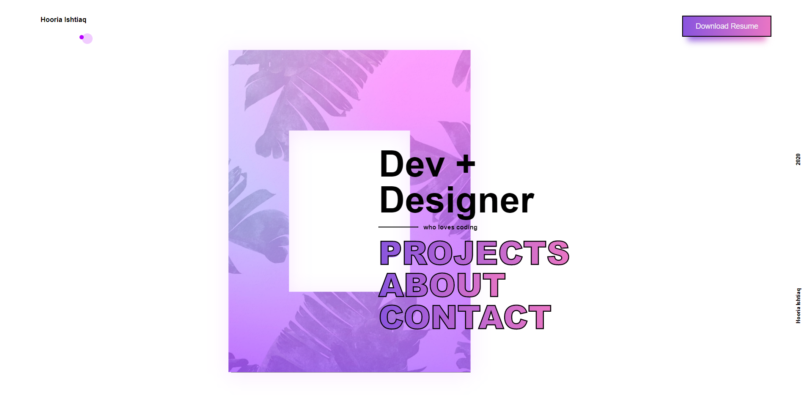

# Portfolio

This is my portfolio website made in ReactJS.

## Demo
heres the link for [Live Preview](https://hooriaishtiaq.netlify.app)

 

## Todo

<input type="checkbox" checked /> <del>Loader to main pages</del>  

<input type="checkbox"/> Loader to project pages  

<input type="checkbox"/> Animated cursor (thats supported in safari, firefox, edge etc)  

<input type="checkbox"/> Update image on home page  

 

## Run Offline
 

#### Available Scripts

##### `yarn start`

Runs the app in the development mode. 
Open [http://localhost:3000](http://localhost:3000) to view it in the browser.

The page will reload if you make edits. 
You will also see any lint errors in the console.
v

##### `yarn build`

Builds the app for production to the `build` folder. 
It correctly bundles React in production mode and optimizes the build for the best performance.

The build is minified and the filenames include the hashes. 
Your app is ready to be deployed!

See the section about [deployment](https://facebook.github.io/create-react-app/docs/deployment) for more information.

